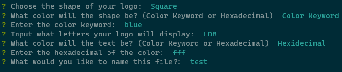

# svg-quickly

[](https://opensource.org/licenses/MIT)

Create a starter svg logo with svg-quickly! With answers to a few prompts, you will be provided with a ready to import svg logo. 

## Table of Contents
- [Installation](#installation)
- [Usage](#usage)
- [Preview](#usage)
- [Questions](#questions)
- [License](#license)

## Installation

> **_NOTE:_**
> This package assumes you already have Node.js and npm installed. If you don't, [download Node.js](https://nodejs.org/en/download) first then come back to these installation steps.

1. Open your terminal and clone the github repo:

```
git clone https://github.com/hokage-216/svg-quickly.git
```

2. 'cd' into the folder:

```
cd readme-please
```

3. Then run this command to install the required packages:

```
npm install
```

## Usage

After installing required packages, you are able to run:

```
npm start
```

The program will begin allowing you to answer each prompt accordingly.



> **_NOTE:_**
> If using a color keyword instead of hexadecimal, make sure the keyword is a valid keyword. The color will not display properly otherwise.

Once you complete answering all the prompts, the svg file will be created within the project folder. If you would like to change where the svg file is exported to, change the 'path' variable within the 'saveSVG' function.

## Preview

Click the image below to view a live demonstation.

[](https://youtu.be/Rgqs9SkTof4)

## Questions

If you have any questions about the repo, open an issue or contact me directly at berrylevente@hotmail.com.

To view more of my work [click here](https://github.com/hokage-216/).

## License

Copyright (c) 2024 LeVente Berry Jr.

Licensed under the MIT license. To view the license terms [click here](https://opensource.org/licenses/MIT).
